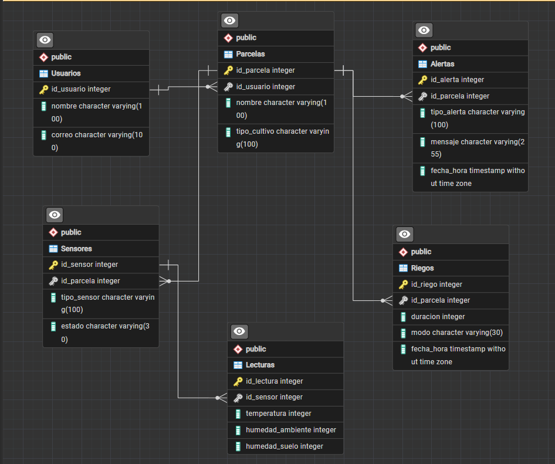

<h1 align="center"> AgroSmart Local</h1>
<p align="center">
  Base de datos del proyecto AgroSmart Local
</p>


## Descripción

AgroSmart Local es un sistema de monitoreo agrícola desarrollado para facilitar el seguimiento de las condiciones de un cultivo. El proyecto permite registrar información relacionada con usuarios, parcelas, sensores, lecturas, riegos y alertas.

La base de datos de AgroSmart Local está diseñada para almacenar y administrar la información utilizada por la aplicación desarrollada en App Inventor.

## 02 · Objetivo

Diseñar y administrar una base de datos que permita organizar la información generada por el sistema AgroSmart, manteniendo relacionadas las diferentes entidades del proyecto.

## Tecnologías utilizadas

| Tecnología | Uso dentro del proyecto |
|---|---|
| PostgreSQL | Gestión y almacenamiento de la base de datos |
| pgAdmin | Administración y consultas de la base de datos |
| GitHub | Control de versiones y trabajo colaborativo |
| MIT App Inventor | Desarrollo de la aplicación |

## Estructura de la base de datos

La base de datos está compuesta por seis tablas principales:

| Tabla | Función |
|---|---|
| `Usuarios` | Información de los usuarios registrados |
| `Parcelas` | Información de las parcelas y cultivos |
| `Sensores` | Sensores asociados a las parcelas |
| `Lecturas` | Datos obtenidos de los sensores |
| `Riegos` | Registro de los riegos realizados |
| `Alertas` | Registro de alertas generadas |

## Modelo físico

El modelo físico representa la estructura de la base de datos,
sus campos, claves y relaciones entre las diferentes tablas.



---
## Integrantes

- Gissel Adayari Díaz López
- Leonardo Abisaí Funez Zetino
- Ariana Valeria Arias Henriquez
  
## Trabajo colaborativo

El proyecto se desarrolla mediante GitHub utilizando ramas
independientes para distribuir las tareas entre los integrantes.

| Integrante | Rama | Responsabilidad |
|---|---|---|
| Gissel Díaz | `usuarios-parcelas`| Usuarios y Parcelas  |
| Leonardo Funes | `sensores-lecturas` | Sensores y Lecturas |
| Valerio Arias | `riegos-alertas` | Riegos y alertas |

Los cambios desarrollados en las diferentes ramas serán
integrados posteriormente en `main`.


## Organización del repositorio

```text
AgroSmart-Local/
│
├── database/
│   ├── 02_datos_prueba.sql
│   ├── 03_consultas.sql
│   └── 04_seguridad.sql
│
├── modelo/
│   └── modelo_fisico.png
│
├── evidencias/
│
└── README.md
